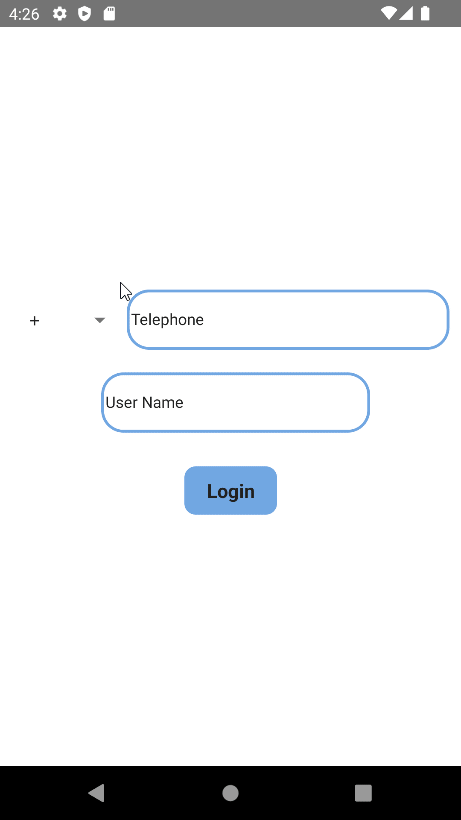

[](https://classroom.github.com/online_ide?assignment_repo_id=8317486&assignment_repo_type=AssignmentRepo)

# TELEGRAM CLONE

## ABOUT PROJECT
In this project, the Telegram's messaging pages are redesigned using React Native. The navigation of the pages is provided with "React Navigation". The project makes use of lorem picsum pictures and mock data produced by the developer. The selection of the country-codes is provided with "React Native Picker". MaterialCommunityIcons was used to create the icons. The data for the receivers and country codes are available in .js format in the /src folder.



## INSTALLATION

Clone the project and run the commands below respectively in the terminal.
```
git clone https://github.com/patika-218-akbank-reactnative-bootcamp/assignment-3-Atakanz.git
```

```
cd WhatsApp
```
```
npx react-native start
```
```
npx react-native run-android
```
## TECHNICALITIES

 At the start of the project, a nested form of stack and bottom navigation is created. A common top-bar custom component is created for all required pages. First, login page and form is shown to user and the page is navigated to bottom-tab screen with login button. Contacts are listed with touchable components and the navigation to personal chatpages which is the third stack screen is provided. The changes such as sended messages are planned to be shown as a list in the second bottom tab but it is the only missing target in the current version. The third bottom-tab page is comprised of stack screen form and includes all the settings pages. First, users can edit their info and toggle the light-dark mode here. Also, log-out button provides user to navigate login page by erasing all user data. 


